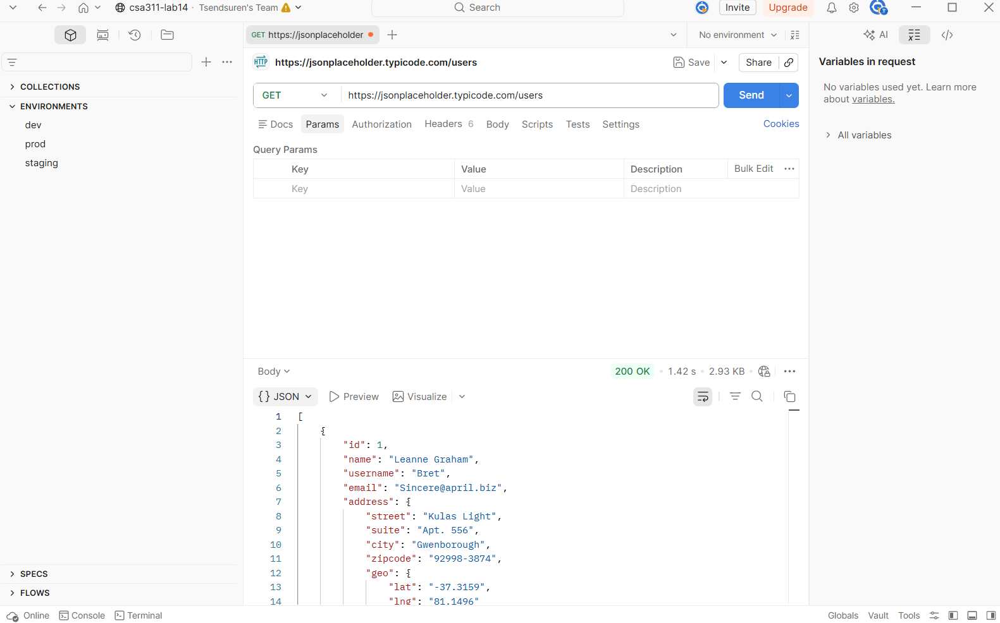

# А хэсэг - Setup

## Сонгосон API: JSONPlaceholder

### Товч тайлбар (Brief)
JSONPlaceholder нь REST API-г тестлэхэд зориулсан үнэгүй, нийтэд нээлттэй хуурамч (fake) онлайн API юм. Жинхэнэ backend серверийг дуурайн ажилладаг бөгөөд CRUD үйлдлүүдийг дэмждэг. Өгөгдлийн бодит өөрчлөлт хийхгүй ч HTTP response-уудыг зөв буцаадаг тул API тестийн дасгалд хамгийн тохиромжтой.

### Нөхцөл байдал
| Шинж чанар       | Дэлгэрэнгүй                        |
|------------------|------------------------------------|
| **Base URL**     | `https://jsonplaceholder.typicode.com` |
| **Auth**         | Байхгүй (auth шаардлагагүй)        |
| **Rate Limit**   | Тодорхойгүй (практикт маш өндөр)  |
| **Формат**       | JSON                                |
| **Документац**   | https://jsonplaceholder.typicode.com |

### Боломжит endpoint-ууд
| Endpoint          | Тайлбар                  |
|-------------------|--------------------------|
| `GET /posts`      | Нийтлэлүүдийн жагсаалт  |
| `GET /posts/:id`  | Нэг нийтлэл              |
| `POST /posts`     | Шинэ нийтлэл үүсгэх     |
| `PUT /posts/:id`  | Нийтлэл бүрэн шинэчлэх  |
| `PATCH /posts/:id`| Нийтлэл хэсэгчлэн шинэчлэх |
| `DELETE /posts/:id`| Нийтлэл устгах          |
| `GET /users`      | Хэрэглэгчдийн жагсаалт  |
| `GET /posts?userId=1` | Хэрэглэгчийн нийтлэлүүд |

### Postman Workspace
- **Workspace нэр:** `F.CSM311 — Lab14`
- **Collection нэр:** `Tserenpuntsag — JSONPlaceholder`
- **Environment-ууд:**
  - `dev` → `baseUrl = https://jsonplaceholder.typicode.com`
  - `staging` → `baseUrl = https://jsonplaceholder.typicode.com` (placeholder)
  - `prod` → `baseUrl = https://jsonplaceholder.typicode.com` (placeholder)

### Тэмдэглэл
JSONPlaceholder нь POST/PUT/DELETE үйлдлүүдэд өгөгдлийг бодитоор хадгалдаггүй ч 201, 200, 204 зэрэг зөв HTTP status code-уудыг буцаадаг тул тестийн зорилгод нийцнэ.

### Баталгаа

  

